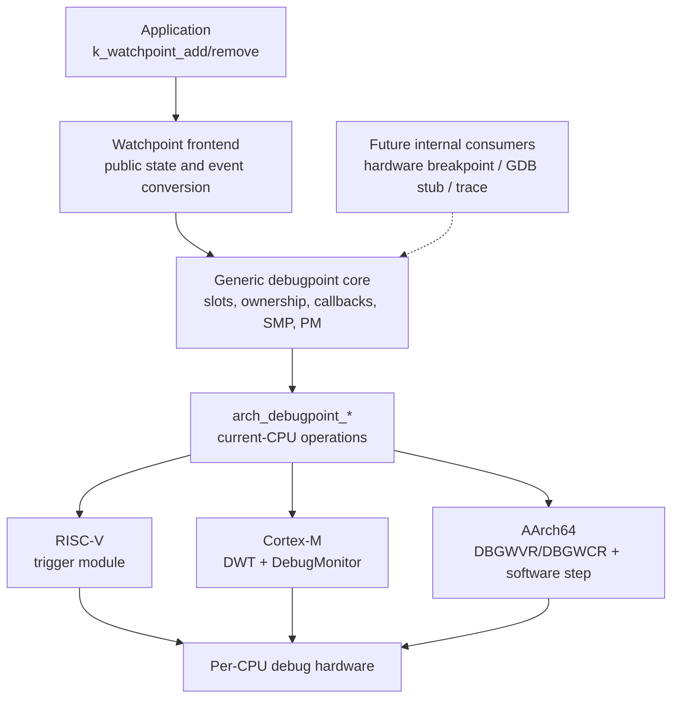
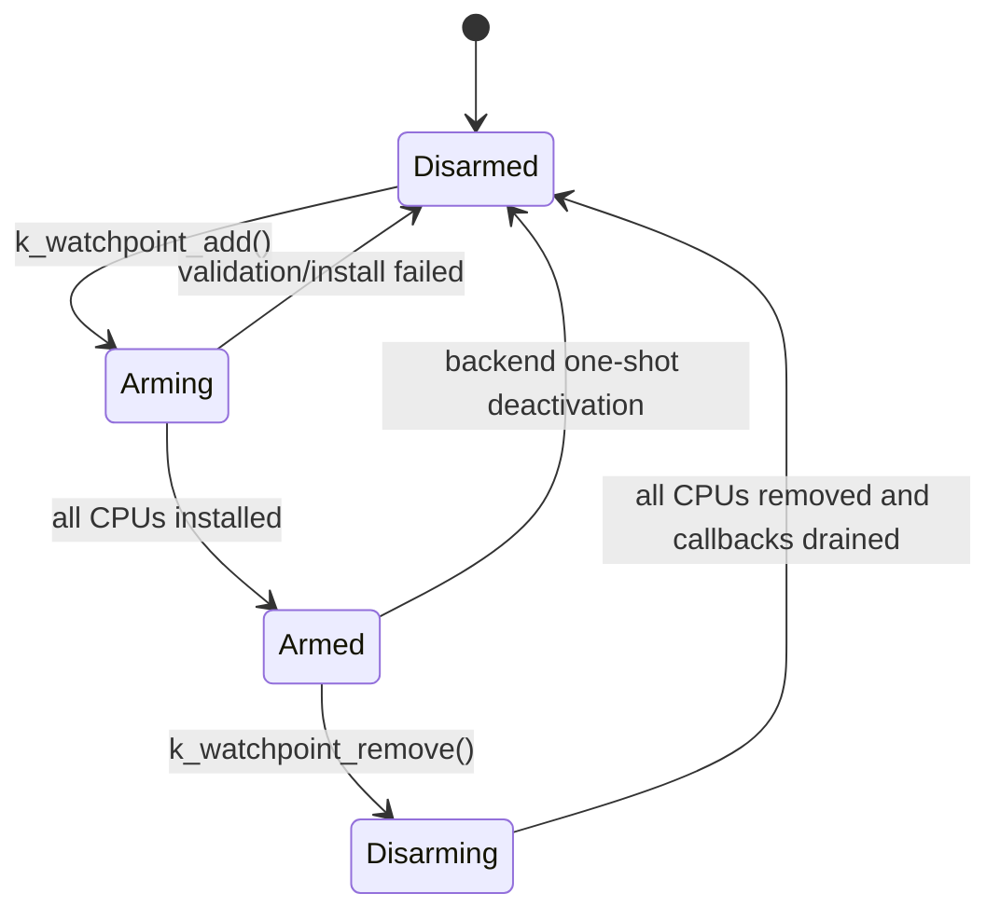
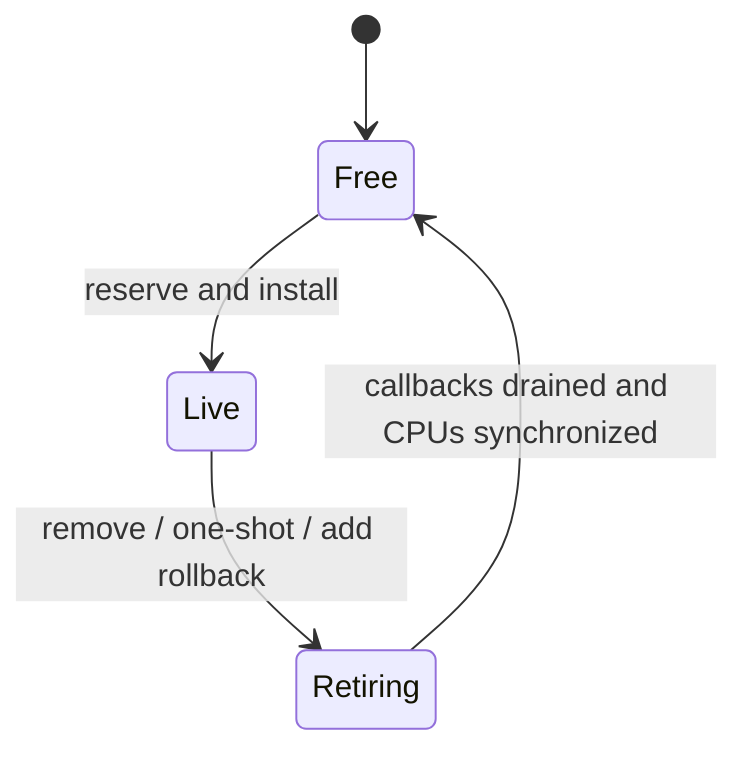
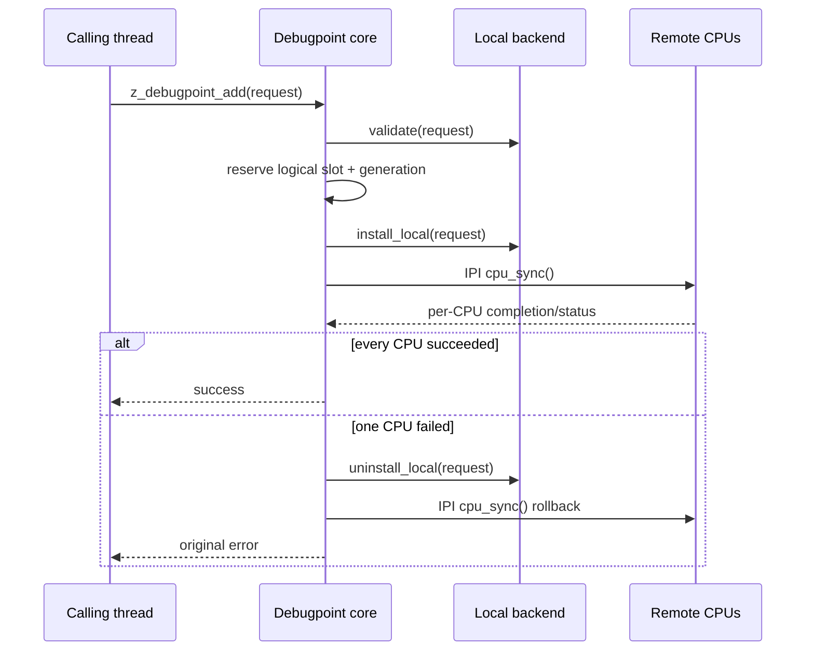
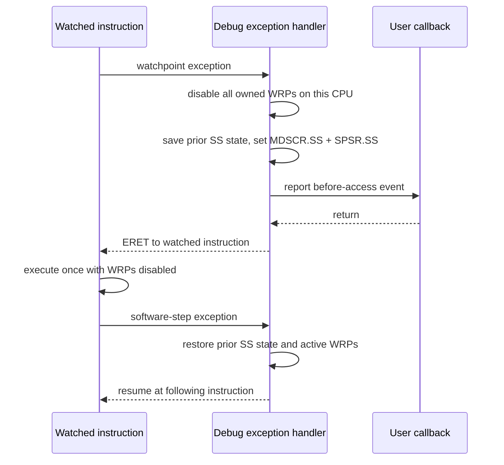
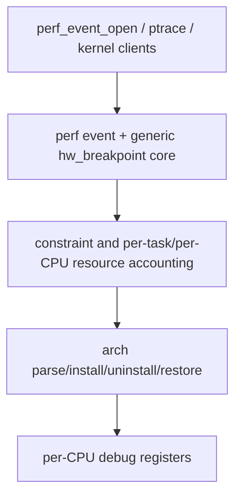

# Hardware Debugpoints and Memory Watchpoints

This document describes the hardware debugpoint framework and the memory
watchpoint frontend implemented in this tree. It is intended both as a design
reference and as a code-review guide. No previous hardware-debug background is
assumed.

## 1. Why this subsystem exists

A memory-corruption failure is often detected much later than the write that
caused it. A normal debugger can stop when the corrupted value is noticed, but
the useful question is usually: which instruction first touched this address?

Modern CPUs contain a small number of address comparators in their debug logic.
Software can program a comparator with an address, access type, and range. A
matching load or store raises a synchronous debug exception. Zephyr can then
capture the faulting context and invoke a bounded callback without instrumenting
every memory access.

This implementation separates two concepts:

- A **debugpoint** is the generic internal description of a hardware debug
  event. Watchpoints and future hardware breakpoints are debugpoint consumers.
- A **watchpoint** is the current public API for observing reads and writes to a
  memory range.

The immediate use case is system-wide memory-corruption diagnosis. A
successfully added watchpoint is installed on every online CPU, so a write is
observed regardless of which CPU executes it.

## 2. Hardware-debug terminology

| Term | Meaning |
| --- | --- |
| Breakpoint | Matches instruction execution, normally by comparing the PC. |
| Watchpoint | Matches a data read, write, or either access type. |
| Comparator | One hardware slot containing an address and match controls. |
| Debug exception | The synchronous exception delivered when a comparator matches. |
| Before timing | The exception is reported before the memory instruction retires. |
| After timing | The exception is reported after the memory instruction retires. |
| Logical slot | A framework-owned debugpoint visible to a frontend. |
| Physical slot | One architecture-specific comparator on one CPU. |
| Self-hosted debug | Debug logic is handled by software running on the same CPU. |
| External debug | A probe such as JTAG controls the debug logic from outside the CPU. |

Breakpoints and watchpoints are often backed by related registers, but they are
not interchangeable. RISC-V trigger slots can represent both. AArch64 provides
separate breakpoint and watchpoint register banks. Cortex-M DWT comparators can
support several data and trace match modes. The generic layer therefore models
the event type while leaving register allocation and encoding to each backend.

## 3. Design goals and limits

The design provides the following guarantees:

1. The public API never silently widens the requested range.
2. On SMP, a successful add or remove has completed on every online CPU.
3. Failed SMP installation is rolled back instead of leaving a partial point.
4. Stale hardware exceptions cannot be delivered to a reused logical slot.
5. Removing a point waits for callbacks that already entered.
6. Architecture backends only program the current CPU.
7. Existing debug resources not owned by this subsystem are preserved when
   they can be identified.
8. Register writes are read back so unsupported WARL or locked configurations
   fail explicitly.

The design intentionally does not provide:

- An unlimited number of watchpoints. Comparator registers are scarce.
- A guarantee that every arbitrary byte range is representable on every CPU.
- A blocking or general-purpose execution environment in the callback.
- Transparent multiplexing with an independent GDB server or external probe.
- CPU hotplug or delayed SMP boot. `CONFIG_SMP_BOOT_DELAY` is excluded.
- A stable public debugpoint API. The public API is currently the watchpoint
  frontend; debugpoint interfaces are internal and can evolve with new users.

## 4. Layered architecture



There is deliberately no separate "SMP layer" between the core and the
architecture API. SMP synchronization is policy owned by the generic core. An
architecture backend describes current-CPU operations; the core invokes those
operations locally and through Zephyr IPI work when a logical point changes.

### 4.1 Public watchpoint frontend

The public API is declared in `include/zephyr/debug/watchpoint.h`:

```c
int k_watchpoint_add(struct k_watchpoint *wp);
int k_watchpoint_remove(struct k_watchpoint *wp);
bool k_watchpoint_is_active(const struct k_watchpoint *wp);
```

`struct k_watchpoint` contains the requested range, access flags, callback, and
user argument. Its private atomic value tracks the inactive, active, adding,
and removing frontend states. Zero initialization is valid;
`K_WATCHPOINT_INITIALIZER` and `K_WATCHPOINT_DEFINE` also initialize this
state.

The frontend in `subsys/debug/watchpoint/watchpoint.c` is responsible for:

- validating public flags and descriptor state;
- converting read, write, and read/write requests to internal types;
- serializing concurrent operations on the same descriptor;
- converting internal events to `struct k_watchpoint_event`;
- capturing an optional bounded call stack; and
- marking a descriptor inactive after a backend-enforced one-shot hit.

### 4.2 Generic debugpoint core

The internal contract is declared in
`include/zephyr/debug/debugpoint_internal.h`. A `struct z_debugpoint` carries a
type, range, callback, owner, and generation-tagged handle.

The core in `subsys/debug/debugpoint/debugpoint.c` owns:

- a fixed table of `CONFIG_DEBUGPOINT_MAX_SLOTS` logical slots;
- unique ownership, so one frontend object cannot occupy two slots;
- generation numbers that reject delayed exceptions from old users;
- add/remove serialization with a mutex;
- exception-safe slot state and callback counts under a spinlock;
- synchronous all-CPU reconciliation;
- transactional rollback after partial installation;
- deferred cleanup for backend one-shot events; and
- current-CPU register restoration after power-state exit.

`CONFIG_DEBUGPOINT_MAX_SLOTS` limits logical objects. It does not promise that
the hardware has that many comparators. A backend can return `-ENOSPC` earlier.

### 4.3 Architecture contract

`include/zephyr/arch/debugpoint.h` defines four operations:

| Operation | Contract |
| --- | --- |
| `arch_debugpoint_validate()` | Check representation without changing state. |
| `arch_debugpoint_install_local()` | Allocate backend state and program this CPU. |
| `arch_debugpoint_uninstall_local()` | Remove the logical point from this CPU and backend state. |
| `arch_debugpoint_cpu_sync()` | Reconcile this CPU with backend logical state without sleeping. |

The first install creates architecture logical state. Other CPUs reproduce that
state from `arch_debugpoint_cpu_sync()`. The last local uninstall marks it
inactive; subsequent CPU sync calls clear remote copies.

Backends report exceptions through `z_debugpoint_hit()`. The generation-tagged
handle, rather than a raw comparator number, identifies the logical point. The
core exposes backend one-shot deactivation to frontends as
`rearm_required` in the callback event.

## 5. Lifecycle and concurrency

### 5.1 Frontend state



`k_watchpoint_add()` returns `-EBUSY` if the same descriptor is armed or is
being changed. Removing a disarmed descriptor is idempotent.

### 5.2 Core slot state

The core has three states:

| State | Meaning |
| --- | --- |
| `FREE` | Slot can be allocated. |
| `LIVE` | The slot owns a debugpoint; hits are accepted and callbacks can enter. |
| `RETIRING` | No new hits are accepted; callback drain or hardware cleanup is pending. |



Explicit remove, exception-time one-shot deactivation, and failed-add rollback
use the same retiring cleanup path. Cleanup safely repeats the local uninstall,
drains callbacks, synchronizes every CPU, and only then releases the slot. A
failed cleanup leaves the slot retiring for a later retry.

The frontend and slot states describe different lifetimes. In steady state,
`DISARMED` corresponds to `FREE`, while `ARMED` corresponds to `LIVE`.
For a one-shot hit, the slot enters `RETIRING` before the callback starts, but
the frontend remains `ARMED` until the callback returns. It then becomes
`DISARMED` while deferred slot cleanup finishes.

The logical slot generation increments on every allocation. A delayed hardware
event containing an old `{slot, generation}` pair is ignored after reuse.

### 5.3 Transactional add



The descriptor is not reported active until the remote IPI work has completed.
This is why success means a write on another CPU can be observed immediately
after `k_watchpoint_add()` returns.

### 5.4 Synchronous SMP update

The core targets every configured CPU. Delayed CPU boot is excluded, so every
target is online and must contain the debugpoint.

The calling CPU runs `arch_debugpoint_cpu_sync()` directly. Other CPUs run it
from an internal immediate IPI-work submission helper, and the caller waits
with `k_ipi_work_wait()`. The first nonzero backend result is retained and
returned. The helper queues work before directly signaling the target mask.
This avoids a lost wakeup if another CPU consumes its own bit from the shared
pending IPI batch.

Add and remove are rejected from ISR, exception callback, and interrupt-locked
contexts. Waiting for remote IPIs from those contexts could deadlock, and a
synchronous API is more useful to a debugger than an ambiguous asynchronous
result.

Add/remove latency is not a real-time API guarantee. On UP it is dominated by
register probing/programming and readback. On SMP it also includes one IPI round
trip and a backend slot scan on every CPU; rollback can require a second round
trip. A CPU that cannot service IPIs delays the caller. The API is intended for
debug setup and teardown, not a hot path.

### 5.5 Callback lifetime

A hit increments the slot callback count before calling the frontend. Remove
changes the slot state so no new callbacks can enter, then waits until the count
reaches zero. For a one-shot hit, the count remains held through frontend
deactivation. The descriptor and its callback data can therefore be released
after a successful remove or automatic deactivation.

Callbacks execute in synchronous exception context and can run concurrently on
different CPUs. They must be short, bounded, and nonblocking. Safe operations
include atomics and copying event data into preallocated storage. The callback
must not call add/remove, sleep, take a mutex, allocate from a blocking heap, or
perform unbounded logging.

Architecture handlers suppress this subsystem's owned comparators while the
callback runs when needed. Callback memory accesses are therefore not promised
to trigger other watchpoints.

## 6. Event and call-stack semantics

`struct k_watchpoint_event` reports:

| Field | Meaning |
| --- | --- |
| `pc` | Architecture-reported instruction location. |
| `access_addr` | Hardware-reported data address, only when valid. |
| `access_addr_valid` | Whether `access_addr` may be consumed. |
| `access_size` | Access width, or zero when hardware does not report it. |
| `flags` | Reported or configured read/write type. |
| `timing` | Before, after, or unknown relative to instruction retirement. |
| `callstack` | Callback-lifetime array of captured PCs, or `NULL`. |
| `callstack_depth` | Number of valid entries in `callstack`. |

The first call-stack entry is the event PC when one is available. Further
entries come from `arch_stack_walk()` using the exception frame. Stack walking
is enabled by `CONFIG_WATCHPOINT_CALLSTACK`, requires `ARCH_STACKWALK`, and is
bounded by `CONFIG_WATCHPOINT_CALLSTACK_DEPTH`.

The callback must copy entries it wants to retain. The array is stack storage in
the frontend callback and becomes invalid on return. Frame pointers improve
results. A hit in an ISR can naturally unwind through interrupt frames rather
than looking exactly like a normal thread stack.

The PC has architecture-specific timing:

- A before event normally points at the memory instruction that has not retired.
- An after event can point at the following instruction.
- The PC is always suitable for symbolization, but code must inspect `timing`
  before treating it as the exact faulting instruction.

## 7. Power management

Debug registers can lose state when a CPU enters a power state. With
`CONFIG_PM`, the core registers a PM notifier. On state exit, the waking CPU
calls `arch_debugpoint_cpu_sync()` to reconstruct its owned hardware registers
from backend logical state.

The PM callback does not perform an SMP broadcast. Each CPU restores its own
bank as it exits the state. The architecture operation must not sleep and must
be valid with interrupts locked.

## 8. RISC-V trigger backend

The RISC-V implementation is in `arch/riscv/core/debugpoint.c` and
`arch/riscv/core/debugpoint_asm.S`. It supports RV32 and RV64 in M-mode.
`CONFIG_RISCV_S_MODE` is excluded because the trigger CSRs used here are
machine-level CSRs.

### 8.1 Trigger-module model

RISC-V exposes an indexed trigger table. Software writes `tselect` to choose a
slot, then accesses `tdata1` and `tdata2` for that slot. A single physical table
can contain different trigger types, including address/data match, instruction
count, interrupt, exception, and implementation-defined triggers.

| CSR | Address | Use in this backend |
| --- | --- | --- |
| `tselect` | `0x7a0` | Select a physical trigger slot. |
| `tdata1` | `0x7a1` | Trigger type, access, privilege, match, timing, and hit state. |
| `tdata2` | `0x7a2` | Exact or NAPOT-encoded comparison address. |
| `tinfo` | `0x7a4` | Optional supported-type bitmap and type-version field. |
| `tcontrol` | `0x7a5` | Optional M-mode trigger enable across trap entry. |

The backend supports type 2 `mcontrol` and type 6 `mcontrol6` address/data
triggers. It does not use `tdata3` or chained triggers.

### 8.2 Relevant `tdata1` fields

The top four XLEN bits hold the trigger `type`; the adjacent `dmode` bit marks a
slot that only Debug Mode may modify. The common low fields include:

| Field | Purpose |
| --- | --- |
| `load`, `store`, `execute` | Select matching operation types. |
| `u`, `s`, `m` | Select privilege modes. This backend programs M and optional U. |
| `match` | Select exact comparison or NAPOT range comparison. |
| `chain` | Combine with the next trigger. Kept clear here. |
| `action` | Select the event action. Zero requests a breakpoint exception. |
| `select` | Address versus data-value comparison. Kept clear for address match. |
| `timing` | Before or after timing where implemented. |
| `hit` | Sticky or encoded match indication where implemented. |

`mcontrol6` version 0 has a timing bit and one hit bit. Version 1 uses a two-bit
hit encoding: 1 means before, 2 means after or imprecise, and 3 means immediately
after. The version comes from `tinfo.version`; versions newer than those the
backend understands are rejected.

Many fields are WARL: a write can legally read back as another supported value.
The backend reads all programmed fields back. It accepts either before or after
timing, but rejects changes that would alter the address range, access type,
privilege, chaining, action, or data selection.

### 8.3 Safe enumeration

The trigger CSRs are optional. `CONFIG_RISCV_HAS_DEBUG_TRIGGER` must therefore
be provided by ISA metadata, the platform, or an explicit user choice before
the backend is compiled. Blindly probing an absent `tselect` CSR would cause an
illegal-instruction exception on real hardware.

Once the base trigger module is known to exist, slot enumeration follows the
Sdtrig algorithm:

1. Save `tselect`.
2. Write an index and verify that `tselect` reads the same index.
3. Try to read optional `tinfo` through an exception-fixup helper.
4. If `tinfo` exists, `info == 1` means no trigger at that index.
5. If `tinfo` is absent, fall back to `tdata1.type == 0` as the end marker.
6. Scan one index beyond the configured software limit to determine whether
   foreign-trigger enumeration was complete.
7. Restore the original `tselect` value.

The assembly helper converts an illegal `tinfo` access into a normal error
return. A similar fixup helper safely reads the instruction at the exception PC
when distinguishing an explicit `ebreak` from a hardware-trigger exception.

### 8.4 Ownership and foreign triggers

Trigger tables can differ between harts. The backend keeps a per-CPU mapping
from each logical backend slot to a physical trigger index. CPU 0 might map a
logical watchpoint to trigger 0 while CPU 1 maps it to trigger 2 because trigger
0 is already used there.
Logical slots are compact and independent of physical trigger indices. A
per-CPU mapping value of `-1` means unowned; a nonnegative value is both the
ownership record and the selected physical trigger index.


A physical trigger is not claimed when:

- `dmode` says only an external debugger may modify it;
- its type can generate an event and it is not already owned here; or
- neither `mcontrol` nor `mcontrol6` is advertised or writable.

Inactive address-match configurations can be reused. Instruction-count,
interrupt, exception, and custom trigger types are conservatively treated as
foreign even when their enable semantics are unknown.

### 8.5 Range encoding

One RISC-V trigger represents either:

- one exact byte; or
- an aligned, power-of-two NAPOT range.

For a range of `size > 1`, `tdata2` is encoded as:

```text
tdata2 = address | ((size - 1) >> 1)
```

An unaligned or non-power-of-two range returns `-ENOTSUP`. The backend does not
round the request outward because that would report accesses the user did not
ask to monitor. Overlapping logical RISC-V watchpoints are rejected because
some implementations do not provide reliable hit bits or access addresses,
making ownership of one shared exception ambiguous.

### 8.6 Programming sequence

For each selected physical slot the backend:

1. disables load/store/execute matching;
2. writes `tdata2`;
3. writes a disabled `tdata1` configuration;
4. reads back all required configuration and address fields;
5. enables the requested access bits; and
6. reads back again before publishing success.

Disabling before changing the address prevents a transient match against a
half-programmed comparator. `tselect` is saved and restored around every public
operation and exception scan.

### 8.7 Exception attribution and resume

Hardware trigger action 0 reports breakpoint exception cause 3, the same cause
used by an explicit `ebreak`. The handler uses this order:

1. Save each owned slot's `tdata1` and temporarily disable owned triggers.
2. Prefer an implemented nonzero hit field.
3. Otherwise use `mtval` when it falls in exactly one owned range.
4. Refuse to consume an explicit 16-bit or 32-bit `ebreak` instruction.
5. If no foreign trigger can fire and only one owned trigger is enabled,
   attribute an address-less exception to that trigger.
6. Return `-ENOENT` for an ambiguous exception so the normal fault path handles
   it rather than stealing another debugger's event.

For after timing, the access has retired and the trigger is restored
immediately. For a supported before-timed scalar memory instruction, the
backend uses the same physical slot to step over the access:

1. fetch and decode the faulting instruction with exception-table fixup;
2. verify an exact-match execute trigger at the sequential next PC;
3. invoke callbacks while every owned trigger remains disabled;
4. mask this CPU's interrupt sources and return to the original instruction;
5. take the execute-trigger exception before the next instruction; and
6. restore the data triggers and interrupt enables.

Supported instructions are standard integer and scalar floating-point loads
and stores, classic Zaamo read-modify-write operations, and the `C.LW/SW`,
`C.LD/SD`, `C.FLW/FSW`, and `C.FLD/FSD` compressed forms. Zaamo `.aq` and
`.rl` ordering bits do not change the resume sequence. The access executes
once while other CPUs keep their watchpoints armed.

LR/SC is excluded because an intervening exception may invalidate the
reservation. Vector memory instructions are excluded because one instruction
may perform multiple independently restartable accesses. Unknown or custom
memory instructions are also excluded.

A fault before the next PC aborts the step and restores the saved state.
Unknown timing, excluded instructions, unavailable execute matching, and
contexts that cannot guarantee the completion trap remain one-shot. The
callback reports this as `rearm_required` instead of risking a retrigger loop.

`mtval` is not guaranteed to contain a useful data address for every trigger
implementation. Consequently `access_addr_valid` and `access_size` must be
checked; access size is currently reported as zero on RISC-V.

### 8.8 `tcontrol` and exception bodies

On implementations with `tcontrol`, trap entry can clear `MTE` while saving it
in `MPTE`. This prevents recursive trigger exceptions in the low-level trap
prologue. If the platform explicitly selects `CONFIG_RISCV_HAS_TCONTROL`, the
backend enables `MTE | MPTE`, and the RISC-V trap assembly re-enables `MTE` only
before application ISR, syscall, or IRQ-offload bodies.

`tcontrol` itself is optional and cannot be probed safely. The Kconfig option
must only be enabled when the CPU documentation confirms CSR `0x7a5` exists.
Without it, watchpoints still work in normal thread code, but detection inside
exception bodies depends on implementation behavior.

## 9. Arm Cortex-M DWT backend

The Cortex-M implementation is in `arch/arm/core/cortex_m/debugpoint.c`. It
uses the Data Watchpoint and Trace unit and delivers matches through
DebugMonitor rather than halting the core.

### 9.1 Registers

| Register | Relevant fields and purpose |
| --- | --- |
| `DHCSR` | `C_DEBUGEN` indicates an attached external debugger owns debug. |
| `DEMCR` | `TRCENA` enables DWT; `MON_EN` enables DebugMonitor. |
| `DWT_CTRL` | `NUMCOMP` reports implemented comparator count. |
| `DWT_COMPn` | Base comparison address for comparator `n`. |
| `DWT_MASKn` | Armv7-M power-of-two address-mask size. |
| `DWT_FUNCTIONn` | Match mode, access type, data size, action, and `MATCHED`. |
| `DFSR` | `DWTTRAP` identifies a DWT-generated DebugMonitor exception. |

The backend is available for Armv7-M and Armv8-M Mainline CPUs with the modern
DWT layout. Armv6-M's different DWT model is excluded.

### 9.2 External and secure debug checks

If `DHCSR.C_DEBUGEN` is set, a probe is using halting debug and add returns
`-EBUSY` rather than competing for registers. On secure Armv8-M builds, secure
DebugMonitor enable state is also checked. `DEMCR.MON_EN` is read back after
initialization.

Comparators that are enabled before subsystem initialization are marked
unavailable and left untouched.

### 9.3 Range representation

Armv7-M uses `DWT_COMPn` plus `DWT_MASKn`, so this backend accepts aligned,
power-of-two ranges. A one-byte range uses mask zero.

Armv8-M Mainline uses address match modes and `DATAVSIZE`; this implementation
accepts aligned 1-, 2-, or 4-byte ranges. Unsupported alignment, size, or a
clamped hardware field is detected by readback and returns `-ENOTSUP`.

### 9.4 Programming and hit path

The comparator is disabled before `COMP`, optional `MASK`, and `FUNCTION` are
written. Data read, data write, and data read/write use the architecture's
corresponding function/match encodings. A DSB and ISB make the update visible
before success is returned.

On `DFSR.DWTTRAP`, the DebugMonitor handler:

1. snapshots `DWT_FUNCTIONn` for every owned comparator;
2. disables all owned comparators to prevent callback recursion;
3. checks each snapshot's `MATCHED` bit;
4. reports one event per matched logical point;
5. reconstructs all still-active comparators; and
6. clears `DFSR.DWTTRAP` only after the event is handled.

Cortex-M reports an after-access event with the stacked PC. This backend does
not have a portable hardware access-address or access-size field, so those
event fields are invalid/zero.

The current Cortex-M backend does not advertise
`ARCH_HAS_DEBUGPOINT_SMP`. The generic core is SMP-capable, but a Cortex-M SMP
port needs tested per-core DWT topology and synchronization before enabling the
capability.

## 10. AArch64 watchpoint backend

The AArch64 implementation is in `arch/arm64/core/debugpoint.c`. Arm provides a
bank of watchpoint value/control register pairs on every Processing Element.

### 10.1 Registers and syndrome fields

| Register/field | Use |
| --- | --- |
| `ID_AA64DFR0_EL1.WRPs` | Number of implemented WRP pairs minus one. |
| `DBGWVRn_EL1` | Eight-byte-aligned watchpoint comparison address. |
| `DBGWCRn_EL1.E` | Enable comparator `n`. |
| `DBGWCRn_EL1.PAC` | Match EL0 and/or EL1 accesses. |
| `DBGWCRn_EL1.LSC` | Match loads, stores, or both. |
| `DBGWCRn_EL1.BAS` | Select watched byte lanes within an eight-byte block. |
| `MDSCR_EL1.MDE` | Enable monitor debug events. |
| `MDSCR_EL1.KDE` | Enable debug exceptions for kernel EL. |
| `MDSCR_EL1.SS` | Enable software-step events. |
| `SPSR_EL1.SS` | Request a step after exception return. |
| `ESR_EL1.EC` | Distinguish watchpoint and software-step exceptions. |
| `ESR_EL1.ISS.WnR` | Distinguish a write from a read. |
| `ESR_EL1.ISS.FnV` | Indicates that `FAR_EL1` is not valid. |
| `FAR_EL1` | Reported memory access address when valid. |

The backend enables both EL0 and EL1 privilege address controls so one logical
watchpoint observes application and kernel accesses. It enables self-hosted
monitor debug through `MDSCR_EL1`, not external halt mode.

### 10.2 Arbitrary byte ranges

One WRP selects any subset of eight byte lanes with `BAS`. The backend splits an
arbitrary, non-overflowing public range at eight-byte boundaries. For example:

```text
request: address 0x1006, size 5

DBGWVR0 = 0x1000, BAS = 11000000b   (0x1006..0x1007)
DBGWVR1 = 0x1008, BAS = 00000111b   (0x1008..0x100a)
```

Both physical slots carry the same generation-tagged logical handle, so the
frontend receives one logical object. A large or poorly aligned range can
consume multiple physical comparators and return `-ENOSPC` even when only one
logical slot is used.

### 10.3 Per-CPU ownership

The logical WRP table is global, while ownership bits are per CPU. During SMP
sync, each CPU checks that the physical WRP is disabled before claiming it.
Enabled foreign WRPs are not overwritten. If any CPU cannot reproduce every
active chunk, generic add rolls the logical watchpoint back on all CPUs.

The exception handler scans all hardware WRPs reported by
`ID_AA64DFR0_EL1`, not only the configured subsystem limit, when checking for a
possible foreign event. This keeps address-less or approximate events from
being incorrectly consumed.

### 10.4 Watchpoint attribution

`ESR_EL1` provides the access type and says whether `FAR_EL1` is valid. Arm
hardware can report an address near, rather than inside, the watched bytes when
one instruction accesses both watched and unwatched memory. The handler:

1. dispatches all unique owned handles whose range contains FAR;
2. otherwise selects the nearest compatible owned range as a hardware-defined
   approximation; and
3. uses the nearest/address-less fallback only when no foreign WRP is enabled.

This mirrors the conservative principle used on RISC-V: an ambiguous exception
is left to the normal exception path rather than claimed from another debug
consumer.

### 10.5 Before-access resume with software step

AArch64 watchpoint exceptions are handled as before-access events in this
implementation. Returning with the comparator still enabled would execute the
same instruction and immediately trap again. The handler uses one-instruction
software stepping:



Preexisting `MDSCR_EL1.SS` and saved `SPSR.SS` bits are preserved. Owned
watchpoints remain disabled only for the single stepped instruction on that
CPU; other CPUs remain armed.

Debug exceptions are masked by `PSTATE.D` on exception entry. The ARM64 low
level paths unmask debug exceptions around application ISR, syscall, and IRQ
offload bodies when the framework is enabled, then mask them again before the
common exception exit. This allows corruption in those bodies to be observed
without exposing fragile entry/exit assembly to recursive debug exceptions.

## 11. Coexistence and future consumers

Hardware debug registers are shared resources. This implementation follows two
rules:

1. Never overwrite a register that is detectably enabled and not owned here.
2. Never consume an ambiguous exception when a foreign trigger could explain it.

This is coexistence protection, not a complete multiplexer. A future Zephyr GDB
stub should use the debugpoint core as another internal consumer instead of
programming the same registers independently. That gives watchpoints and the
stub one owner table, one generation model, one SMP policy, and one exception
dispatch path.

The internal enum already reserves `Z_DEBUGPOINT_BREAKPOINT`. Adding hardware
breakpoints would require:

- a frontend or debugger-facing request API;
- per-architecture execute-match validation and register encoding;
- breakpoint-specific resume semantics; and
- shared resource accounting where breakpoint and watchpoint registers overlap,
  as they do in the RISC-V trigger table.

No public ABI depends on the current internal structure, so capabilities,
priorities, task-scoped ownership, or a debugger exception chain can be added
without changing the watchpoint descriptor.

## 12. Comparison with Linux

This section compares architecture and capability, not source-code size. Linux
has a mature multi-user performance/debug subsystem; Zephyr has a much smaller
system-wide debugging requirement and no process scheduler model to reproduce.
The useful question is therefore which mechanisms are equivalent, and which
Linux capabilities are intentionally not present yet.

### 12.1 Framework shape

Linux routes hardware breakpoints through the perf-event framework:



The Zephyr layers are conceptually similar, but the current policy is simpler:

- `struct z_debugpoint` plays the consumer-neutral hardware-event role.
- The debugpoint core owns logical allocation, lifetime, and all-CPU policy.
- `arch_debugpoint_*` plays the current-CPU programming role.
- `k_watchpoint_*` is one focused frontend instead of a perf event ABI.

This is the same architectural direction, not a claim that the frameworks have
equal breadth.

### 12.2 Capability matrix

| Capability | This Zephyr implementation | Linux hardware-breakpoint framework |
| --- | --- | --- |
| Kernel-wide data watchpoint | Yes, synchronously installed on all online CPUs. | Yes, through wide per-CPU perf events. |
| Read/write/read-write match | Yes. | Yes on supporting architectures. |
| Exception-context callback | Yes. | Yes, through perf overflow handlers. |
| Generation-safe stale-hit rejection | Explicit logical handle generation. | Perf-event lifetime, RCU, and per-CPU slot ownership. |
| Per-CPU hardware state | Yes in SMP backends. | Yes. |
| Per-task watchpoint | No; points are system-wide. | Yes; registers follow task scheduling. |
| User ABI | No public syscall; application code uses the Zephyr API. | `perf_event_open`, ptrace, and debugger integration. |
| Execute breakpoint | Internal type reserved, backend not implemented. | Implemented on supported architectures. |
| Resource constraints | Fixed logical table plus backend allocation/readback. | Global/per-CPU/per-task constraint accounting. |
| Event sampling/accounting | No; callback notification only. | Full perf sampling, counters, filters, and callchains. |
| CPU hotplug | No; delayed SMP boot is excluded. | Integrated with CPU hotplug. |
| Power-state restore | Current CPU PM notifier. | Architecture CPU-PM/hotplug restore hooks. |
| Debugger multiplexing | Protects foreign resources, but has no common debugger owner yet. | perf, ptrace, and arch debugger hooks use established ownership paths. |
| Arbitrary ARM64 byte range | Yes, split across WRPs as needed. | A perf request normally maps to one WRP and BAS block. |

Linux's generic core performs substantially more accounting because a CPU can
simultaneously have CPU-pinned events and events belonging to whichever task is
running. It checks that the worst-case combination fits before accepting a new
event. Zephyr's current global point has only one scope: every online CPU.
Transactional all-CPU install is enough for that scope and gives a direct
success guarantee to the memory-corruption API.

### 12.3 RISC-V

At the Linux master revision reviewed in July 2026, `arch/riscv` has no generic
hardware-breakpoint/watchpoint backend. Linux's generic core exists, but RISC-V
does not provide the architecture hooks needed to expose Debug Trigger Module
watchpoints through perf or ptrace.

The privilege model is an important difference. Standard RISC-V Linux runs its
kernel in S-mode, while `tselect`, `tdata*`, and `tcontrol` are machine-level
CSRs. A Linux implementation would need an architected supervisor interface,
firmware/SBI mediation, or hardware that delegates trigger access. This Zephyr
backend runs in M-mode and can program the CSRs directly.

Consequently, for RV32/RV64 M-mode, this implementation currently provides a
self-hosted kernel watchpoint capability that upstream Linux RISC-V does not
provide. Its quality baseline must come from Sdtrig conformance, QEMU and real
hart testing, and conservative coexistence rather than from copying a Linux
RISC-V backend.

### 12.4 Cortex-M

Linux's 32-bit Arm `HAVE_HW_BREAKPOINT` selection covers classic Armv6/v7 debug
architectures, not `CPU_V7M`; its mainstream backend is not a Cortex-M DWT
watchpoint implementation. Zephyr's DWT/DebugMonitor backend therefore serves a
different hardware and operating-system profile.

The Zephyr path is narrower but appropriate for microcontrollers: no process
perf ABI, direct DebugMonitor callbacks, strict external-debug ownership checks,
and explicit comparator readback.

### 12.5 AArch64 low-level comparison

The AArch64 implementation is directly comparable. Both Linux and this backend:

- discover the WRP count from `ID_AA64DFR0_EL1`;
- keep software ownership for per-CPU `DBGWVR/DBGWCR` slots;
- encode privilege, load/store type, and BAS byte lanes in `DBGWCR`;
- enable self-hosted monitor debug through `MDSCR_EL1`;
- use `ESR_ELx.WnR` and `FAR_ELx` for attribution;
- account for the architecture reporting an address near the watched bytes;
- temporarily disable watchpoints that would retrigger; and
- use a software-step exception to execute the watched instruction once before
  restoring watchpoints.

Important differences remain:

| Area | Zephyr | Linux ARM64 |
| --- | --- | --- |
| Scope | One logical point covers EL0 and EL1 on every CPU. | Events can be task, CPU, EL0, or EL1 scoped. |
| Range | One logical request can consume multiple WRP/BAS chunks. | A perf watchpoint normally maps to one WRP. |
| Single-step ownership | Preserves preexisting SS register bits. | Integrates with task single-step state and forwards suspended debugger steps. |
| Slot sharing | Refuses detectably enabled foreign WRPs. | Kernel perf owns and restores its registered slots. |
| Hotplug/heterogeneity | No CPU hotplug; add rolls back if an online CPU cannot mirror state. | CPU hotplug and task migration are first-class paths. |
| Event delivery | Direct bounded callback with optional stack walk. | Perf overflow, signals, ptrace, and callchain infrastructure. |
| Breakpoints | Not implemented yet. | BVR/BCR execution breakpoints share the framework. |

For the current goal, the most important ARM64 hardware details are not missing:
range encoding, per-CPU programming, conservative hit attribution, finite
before-access recovery, SMP consistency, and PM restore are all present. Linux
is still the stronger reference for debugger coexistence, task-scoped state,
hotplug, and single-step composition with another consumer.

### 12.6 Can it reach Linux capability?

For **finding who corrupted one system-wide address**, yes: the current API can
provide the core Linux-style result on the supported Zephyr targets. It arms
every CPU, reports the triggering exception context, exposes a bounded call
stack, and safely resumes or makes the point one-shot according to hardware
timing.

For **the complete Linux hardware-breakpoint facility**, no. Reaching that
breadth would require at least:

1. hardware execute-breakpoint backends and resume policy;
2. task- and CPU-scoped points with context-switch integration;
3. a shared resource manager for watchpoint, breakpoint, and debugger clients;
4. an exception-dispatch chain that composes with GDB single-step state;
5. CPU hotplug and delayed-boot handling;
6. user/debugger ABI integration; and
7. much broader physical-hardware and firmware-permission validation.

Those are compatible extensions to the current layering. They are not required
to make the present system-wide corruption debugger useful, and pretending they
already exist would obscure the actual review boundary.

## 13. Return codes and observable behavior

| Result | Typical reason |
| --- | --- |
| `0` | Requested operation completed with its documented SMP semantics. |
| `-EINVAL` | Null callback, zero size, invalid flags, or address overflow. |
| `-EBUSY` | Descriptor transition, external debugger ownership, or busy hardware. |
| `-EWOULDBLOCK` | ISR, callback, or interrupt-locked call context. |
| `-ENOSPC` | No logical slot or suitable physical comparator remains. |
| `-ENOTSUP` | Backend absent, range cannot be encoded, or register readback failed. |

Backend availability is runtime-sensitive. A build can support watchpoints while
a particular board returns `-ENOTSUP` because debug registers are absent,
locked, trapped by firmware, or do not implement the requested WARL fields.

## 14. Configuration map

| Option | Purpose |
| --- | --- |
| `CONFIG_WATCHPOINT` | Build the public API. |
| `CONFIG_WATCHPOINT_HW` | Use the architecture hardware backend. |
| `CONFIG_WATCHPOINT_CALLSTACK` | Capture a bounded stack for each event. |
| `CONFIG_WATCHPOINT_CALLSTACK_DEPTH` | Maximum captured entries. |
| `CONFIG_DEBUGPOINT_MAX_SLOTS` | Generic logical-slot upper bound. |
| `CONFIG_RISCV_HAS_DEBUG_TRIGGER` | Assert that base trigger CSRs exist. |
| `CONFIG_RISCV_HAS_TCONTROL` | Assert that optional `tcontrol` exists. |
| `CONFIG_RISCV_DEBUG_TRIGGER_MAX_SLOTS` | RISC-V scan/storage upper bound. |
| `CONFIG_ARM_WATCHPOINT_MAX_SLOTS` | Cortex-M DWT storage upper bound. |
| `CONFIG_ARM64_WATCHPOINT_MAX_SLOTS` | AArch64 WRP storage upper bound. |

`ARCH_HAS_WATCHPOINT` selects whether an architecture can provide the hardware
frontend. `ARCH_HAS_DEBUGPOINT_SMP` additionally states that its current-CPU
sync operation is safe and supported from IPI context.

## 15. Test coverage

`tests/debug/watchpoint` covers the public contract and backend edge cases on
RV32, RV64, Cortex-M, and AArch64. The matrix includes RISC-V and AArch64 SMP and
userspace variants.

Major scenarios include:

- read, write, and read/write events;
- access completion and before/after memory-state consistency;
- byte ranges, exact range behavior, and cross-granule ranges;
- zero initialization, invalid flags, zero size, address overflow, and address zero;
- idempotent remove, descriptor reuse, and double add;
- multiple points, resource exhaustion, and resource reuse;
- callback recursion suppression and callback-context rejection;
- ISR hits and API rejection from ISR/interrupt-locked contexts;
- userspace access and saved call-stack output;
- remote-CPU hits and add/remove initiated on another CPU;
- concurrent SMP add serialization;
- RISC-V unsupported range and overlap rejection;
- explicit RISC-V `ebreak` preservation;
- back-to-back scalar loads and stores for every base integer width;
- compressed integer and floating-point access completion;
- classic Zaamo operations, ordering bits, and RV64 doubleword AMO;
- simultaneous AMO hits on two harts;
- RISC-V per-hart remapping around a foreign trigger; and
- remove waiting for an in-progress callback on another CPU.

QEMU proves architectural behavior for the emulated CPUs. Real-board builds
prove compilation and link integration, but only physical hardware execution
can validate a particular core's optional debug implementation, firmware debug
permissions, and power-domain retention.

## 16. Code-review map

| Area | Primary files |
| --- | --- |
| Public API | `include/zephyr/debug/watchpoint.h` |
| Watchpoint frontend | `subsys/debug/watchpoint/watchpoint.c` |
| Internal model | `include/zephyr/debug/debugpoint_internal.h` |
| Generic core | `subsys/debug/debugpoint/debugpoint.c` |
| Architecture contract | `include/zephyr/arch/debugpoint.h` |
| Generic SMP IPI primitive | `include/zephyr/kernel.h`, `kernel/smp/ipi.c` |
| RISC-V backend | `arch/riscv/core/debugpoint.c`, `debugpoint_asm.S` |
| Cortex-M backend | `arch/arm/core/cortex_m/debugpoint.c` |
| AArch64 backend | `arch/arm64/core/debugpoint.c` |
| Public behavior tests | `tests/debug/watchpoint/src/main.c` |

Useful invariants to check while reviewing changes:

1. No backend operation sleeps or programs another CPU directly.
2. A physical comparator is disabled before its address/control is changed.
3. Every enabled register write has a meaningful readback check.
4. Foreign enabled resources are never cleared as part of normal ownership.
5. A hit is delivered only through a matching slot generation.
6. A failed add either never publishes state or completes rollback.
7. Remove prevents new callbacks before waiting for old callbacks.
8. Before-access handlers have a finite resume strategy.
9. The exception path leaves unrelated debug exceptions unconsumed.
10. PM and SMP reconstruction use the same canonical backend state.

## 17. Architecture references

- [RISC-V Debug Specification, Sdtrig](https://docs.riscv.org/reference/debug/v1.0/Sdtrig.html)
- [Armv8-A self-hosted debug overview](https://developer.arm.com/-/media/Arm%20Developer%20Community/PDF/Learn%20the%20Architecture/Arm%20V8A%20self-hosted%20debug.pdf)
- [Armv7-M Architecture Reference Manual](https://developer.arm.com/documentation/ddi0403/latest/)
- [Armv8-M Architecture Reference Manual](https://developer.arm.com/documentation/ddi0553/latest/)
- [Linux generic hardware-breakpoint core](https://github.com/torvalds/linux/blob/master/kernel/events/hw_breakpoint.c)
- [Linux Arm architecture Kconfig](https://github.com/torvalds/linux/blob/master/arch/arm/Kconfig)
- [Linux ARM64 hardware breakpoint implementation](https://github.com/torvalds/linux/blob/master/arch/arm64/kernel/hw_breakpoint.c)
- [Linux RISC-V architecture directory](https://github.com/torvalds/linux/tree/master/arch/riscv)
